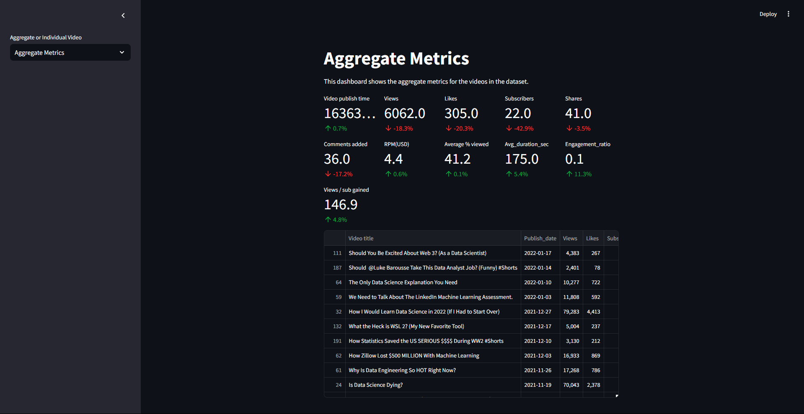
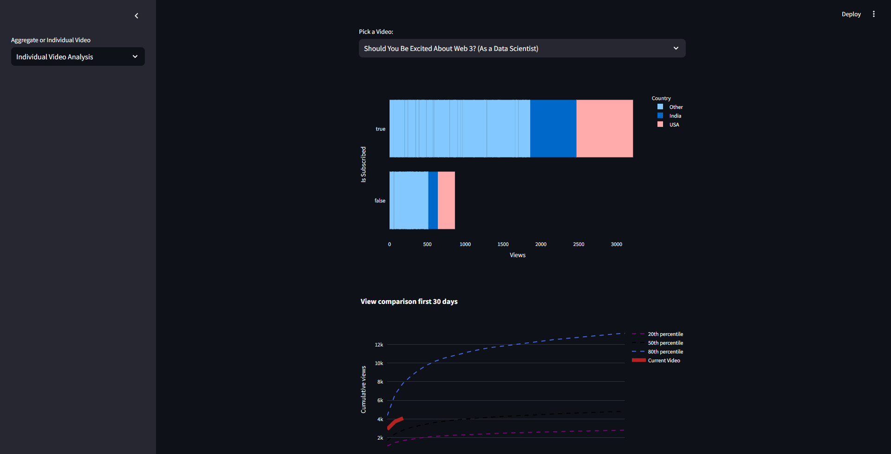

# YouTube Analytics Dashboard

This repository contains a **Streamlit-based dashboard** for visualizing and analyzing YouTube video performance metrics. The dashboard provides insights into aggregated metrics and individual video performance, including subscriber engagement, view trends, and audience demographics.

## Features

### 1. **Aggregate Metrics**
   - Displays key metrics for all videos (e.g., views, likes, subscribers, and engagement ratio).
   - Compares performance over the last 6 months and 12 months with percentage changes.
   - Visualizes cumulative views for the first 30 days across all videos.

### 2. **Individual Video Analysis**
   - Provides detailed metrics for a selected video.
   - Audience segmentation by country and subscription status.
   - Compares video performance (views) with 20th, 50th (median), and 80th percentiles.

### 3. **Visualizations**
   - Interactive bar charts for audience analysis by country.
   - Line charts comparing cumulative views for the first 30 days.

## Installation

1. Clone the repository:
   ```bash
   git clone https://github.com/your-username/youtube-analytics-dashboard.git
   cd youtube-analytics-dashboard
   ```
2. Run the dashboard:
   ```bash
   streamlit run dashboard.py
   ```

## File Structure

```
.
├── dashboard.py                # Main Streamlit application code
├── Aggregated_Metrics_By_Video.csv  # Dataset containing video-level metrics
├── Aggregated_Metrics_By_Country_And_Subscriber_Status.csv # Dataset for country-level metrics
├── Video_Performance_Over_Time.csv  # Dataset tracking video performance over time
└── README.md                   # Project documentation
```

## Datasets

### 1. `Aggregated_Metrics_By_Video.csv`
   - Contains video-level performance metrics like views, likes, shares, and CPM.

### 2. `Aggregated_Metrics_By_Country_And_Subscriber_Status.csv`
   - Tracks audience demographics (country and subscription status).

### 3. `Video_Performance_Over_Time.csv`
   - Tracks daily performance metrics such as views and cumulative performance over time.

## Key Functions

### `load_data()`
   - Loads and preprocesses datasets, including parsing dates and calculating additional metrics (e.g., engagement ratio).

### `audience_simple(country)`
   - Simplifies country codes into broader categories (e.g., US = USA, IN = India).

### Visualizations
   - Bar chart: Audience segmentation by subscription and country.
   - Line chart: Cumulative views compared against 20th, 50th, and 80th percentiles.

## Example Screenshots

### Aggregate Metrics


### Individual Video Analysis



